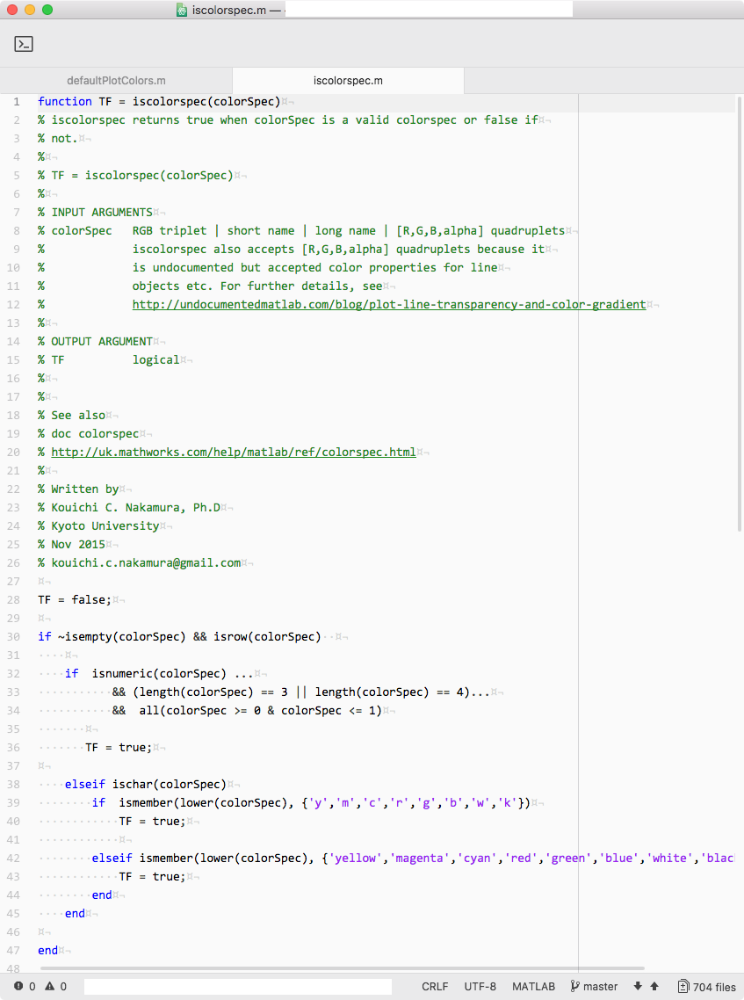

# README for Atom-styles-less-for-MATLAB

styles.less file customization for MATLAB language in Atom editor.

This style will mimic the appearance of MATLAB in Atom editor.    

## Requirements

+ [Atom text editor](https://atom.io/)
+ [`language-matlab`](https://atom.io/packages/language-matlab) Atom package

## How to use it?

1. Choose *Atom menu > Stylesheet...*
2. The `styles.less` file will open.
3. At the bottom of the file, copy and paste the content of ` 	Atom styles-less for MATLAB.less`
4. The style only works with MATLAB format. Sometimes a MATLAB .m file can be recognized as a Octave .m file. In order to change the grammar, follow the steps below:
   1. *Edit > Select Grammar...*
   2. Type `MATLAB` into the query box
   3. Choose `MATLAB`

written by Dr Kouichi C. Nakamura

MRC BNDU, University of Oxford

kouichi.c.nakamuara@gmail.com